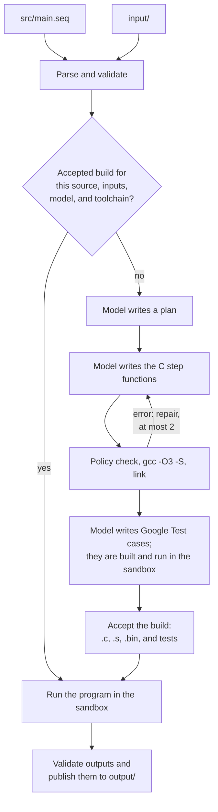

<p align="center">
  
</p>

# seq-lang

Seq describes an ordered workflow as natural-language requests. Its compiler, `seqc`, parses and validates the workflow, asks a language model at compile time to write a complete C program for it, compiles that program with GCC, runs it in a sandbox, and publishes the files it produced under `output/`.

```seq
model("https://huggingface.co/Qwen/Qwen2.5-Coder-1.5B-Instruct")
backend.C()
name = "hello"

step step1():
    ask("print Hello from Seq")
```

Parsing and step order are deterministic. The synthesized program is not: a request in natural language is not a formal specification, and a program that compiles is not proof that it does what the request meant.

## How a build works



## Status

Version 0.1.0, Linux x86_64. The compiler pipeline is implemented and covered by a deterministic test suite that uses a scripted model.

**Not yet verified with a real model.** The feasibility spike of the plan (Phase 0) and every live-model acceptance criterion need llama.cpp and the model weights, which were not available when this was built. The llama.cpp adapter is tested only against a local stand-in for `llama-server`. [docs/decisions.md](docs/decisions.md) lists what was decided, what was measured, and what is still open.

## Requirements

| To | You need |
| --- | --- |
| Build `seqc` | CMake 3.28 or newer, Ninja, GCC 13 or newer (or another C++20 compiler) |
| Run the test suite | The above, plus `python3`, `bash`, and `curl` |
| Compile and run workflows | Linux x86_64 with kernel 6.2 or newer (Landlock ABI 3), GCC with the static C library, `g++`, Google Test, and llama.cpp's `llama-server` |

The reference environment is Ubuntu 24.04 LTS. On Ubuntu:

```sh
sudo apt install build-essential cmake ninja-build libgtest-dev curl python3
```

`llama-server` comes from [llama.cpp](https://github.com/ggml-org/llama.cpp); put it on `PATH` or set `model.llama_server`.

On Windows, use WSL2. A native Windows build of `seqc` can scaffold, check, and clean projects but cannot build or run them. Under WSL2, a build tree or project on a Windows drive (`/mnt/c`, `/mnt/d`) works but is several times slower than one on the Linux filesystem; to build this repository outside the checkout:

```sh
cmake -S . -B ~/seq-build/dev -G Ninja && cmake --build ~/seq-build/dev && ctest --test-dir ~/seq-build/dev -j 6
```

## Install

```sh
curl -fsSL https://raw.githubusercontent.com/tomjnet/seq-lang/HEAD/install.sh | bash
```

The installer needs no root. It puts `seqc` in `~/.local/bin` and its runtime library and templates in `~/.local/lib/seqc`, then runs `seqc doctor` to say what compiling and running workflows still needs. It never downloads a model and never installs system packages.

It downloads the package of the latest release and verifies its SHA-256 checksum. The package is built on Ubuntu 24.04 and needs glibc 2.39 or newer. On an older system, for a branch, or when there is no release yet, the installer clones the repository and builds from source, which needs the build requirements above.

| Option | Effect |
| --- | --- |
| `--prefix DIR` | Install under `DIR` instead of `~/.local`. |
| `--ref REF` | A release tag such as `v0.1.0`, or a branch when building from source. |
| `--binary`, `--from-source` | Use only the release package, or always build. |
| `--source DIR` | Build from a local checkout. |
| `--check` | Report what is missing without installing. |
| `--uninstall` | Remove the installed files. Downloaded models and settings are kept. |

Pass options after `bash -s --`, or run `./install.sh --help` in a checkout for the full list.

## Build

```sh
cmake --preset dev
cmake --build --preset dev
ctest --preset dev
```

The binary is `build/dev/bin/seqc`. It finds its runtime and templates in `build/dev/lib/seqc`, so it runs from the build tree.

| Preset | Purpose |
| --- | --- |
| `dev` | Debug build. |
| `release` | Optimized build. |
| `asan` | Debug build of `seqc` with address and undefined-behavior sanitizers. |

To install, or to make a release tarball with its SHA-256 checksum:

```sh
cmake --install build/release --prefix ~/.local
```

```sh
cd build/release && cpack
```

### Continuous integration and releases

| Workflow | Runs on | Does |
| --- | --- | --- |
| [ci.yml](.github/workflows/ci.yml) | Every push and pull request | Builds and tests the `dev`, `release`, and `asan` presets on Ubuntu 24.04 and the portable subset on Windows; lints `install.sh` and installs with it from source and from a package. |
| [release.yml](.github/workflows/release.yml) | A tag `vX.Y.Z` | Builds and tests `seqc`, packages `seqc-linux-x86_64.tar.gz`, installs it with `install.sh`, and publishes a GitHub Release with `SHA256SUMS`. |
| [pages.yml](.github/workflows/pages.yml) | Changes under `website/` on `main` | Publishes the website to GitHub Pages. |

To release, set the version in `CMakeLists.txt`, give its `CHANGELOG.md` heading a date in place of "unreleased", and push the tag:

```sh
git tag -a v0.1.0 -m "seqc 0.1.0" && git push origin v0.1.0
```

The release workflow refuses a tag that does not match both files.

## Use

```sh
seqc new top3Company
cd top3Company
seqc doctor
seqc model pull
seqc src/main.seq
```

`seqc doctor` says, one line per prerequisite, whether this host can compile and run workflows. `seqc model pull` downloads the model (about 1.1 GB) into `~/.cache/seqc/models`, verifies its SHA-256, and writes `seq.lock`. It is the only command that downloads anything. A build never does.

`seqc src/main.seq` then validates the workflow, builds it (or reuses the last accepted build if nothing changed), runs it, and lists the results:

```text
Results:
  output/company.txt  (212 bytes)
  output/top3Company.png  (4.1 KiB)  final
```

| Command | What it does |
| --- | --- |
| `seqc new <name>` | Create a project. Needs no model and no compiler. |
| `seqc <file.seq>` | Validate, build or reuse the cached build, run, and list results. |
| `seqc check <file.seq>` | Parse and validate only. |
| `seqc doctor` | Check the prerequisites on this host. |
| `seqc model pull [--update]` | Download, verify, and lock the project's model. |
| `seqc clean [--all]` | Remove run records; `--all` also removes build artifacts. Outputs and inputs are kept. |
| `seqc --settings` | List every setting and its default. |

Options for `seqc <file.seq>`: `--build-only`, `--rebuild`, `--force`, `--quiet`. Every command accepts `--set section.key=value`.

Settings are read from `--set` flags, then `SEQC_<SECTION>_<KEY>` environment variables, then `~/.config/seqc/config.toml`, then built-in defaults.

## What a project looks like

```text
top3Company/
├── seq.lock                 pinned model (written by `seqc model pull`)
├── src/main.seq             the workflow
├── input/                   read-only data for the workflow
└── output/
    ├── company.txt          published results
    ├── top3Company.png
    └── temp/                compiler-owned
        ├── top3Company.c    generated program
        ├── top3Company.s    its optimized assembly
        ├── top3Company.bin  executable linked from that assembly
        ├── test/            generated Google Test file and binary
        ├── build.json       manifest of the accepted build
        └── runs/<run-id>/   plan, attempts, logs, and manifests of each run
```

## Failure recovery

| Exit | Meaning | What to do |
| --- | --- | --- |
| 2 | Bad command line or setting | Read the message; `seqc --help`. |
| 3 | The workflow is not valid | Fix the reported `path:line:column`. [docs/language.md](docs/language.md) explains every code. |
| 4 | The model could not be used, or its response was unusable | `seqc doctor`; `seqc model pull`; rerun (use `--rebuild` to ask again). |
| 5 | The generated program or its tests were not accepted within the repair limit | Inspect `output/temp/runs/<run-id>/attempts/`; reword the requests; rerun. |
| 6 | The program failed, hit a limit, or produced invalid outputs | Read the step message; nothing was published. Limits are settings under `limits.`. |
| 7 | A filesystem or isolation rule stopped the run | An output would overwrite a file seqc did not create (move it or use `--force`), another `seqc` is running, or the sandbox is unavailable. |
| 8 | A prerequisite is missing | `seqc doctor`. |

A failed build never replaces the last accepted build and never runs a stale executable.

## Documentation

- [docs/language.md](docs/language.md): syntax, limits, diagnostic codes, exit statuses.
- [docs/architecture.md](docs/architecture.md): pipeline, model protocol, build cache, manifests, settings.
- [docs/runtime.md](docs/runtime.md): the contract between `seqc` and generated code, the runtime API, generated tests.
- [docs/security.md](docs/security.md): the sandbox, what it denies, where it was tested, known limits.
- [docs/decisions.md](docs/decisions.md): decisions made at the plan's gates and open items.
- [docs/legacy.md](docs/legacy.md): how seq-lang and `seqc` differ from seq-lang-legacy and `seqc_legacy`.
- SeqAtom Model: In-progress: https://huggingface.co/tomjnet/SeqAtom-Coder-1.5B-Instruct

## License

MIT for the original code in this repository. See [LICENSE](LICENSE) and [THIRD_PARTY_NOTICES.md](THIRD_PARTY_NOTICES.md). Model weights, llama.cpp, GCC, and Google Test keep their own licenses.
