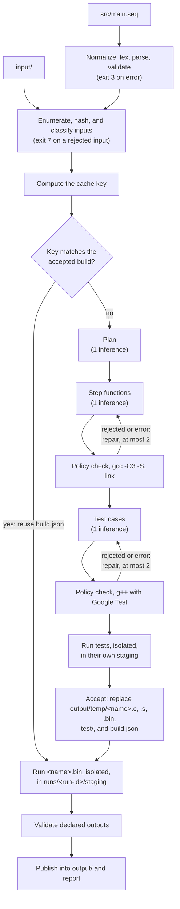

# Architecture

This page describes how `seqc` 0.1 is built.

## Pipeline



Nothing is inferred or compiled until the source and the inputs are valid. Nothing is executed unless a complete build was accepted.

## Source layout

| Directory | Responsibility |
| --- | --- |
| `include/seq/` | Interfaces shared across components: the syntax tree, diagnostics, the model adapter, the backend, exit statuses. |
| `src/lexer/`, `src/parser/`, `src/validation/` | Normalization and tokens; the syntax tree as written; cardinality, support, names, and limits. |
| `src/project/` | Project paths, `seqc new`, the templates in `output/temp/`, input enumeration, `seqc clean`. |
| `src/model/` | Model resolution and `seq.lock`, `seqc model pull`, the llama.cpp adapter, the scripted adapter used by tests. |
| `src/planner/` | Prompts, response schemas, and validation of the plan. |
| `src/backends/c/` | Composition of the C unit and the test file around model-written code; the hygiene checks. |
| `src/toolchain/` | Locating GCC and g++, and running them in the build sandbox. |
| `src/cache/` | The cache key and the accepted-build manifest. |
| `src/execution/` | Running generated code in the run sandbox, reading step records and test results, validating and publishing outputs. |
| `src/cli/` | Command routing and the build pipeline. |
| `src/support/` | JSON, SHA-256, settings, files, and the process runner with the sandbox. |
| `runtime/` | The C library linked into every generated program. See [runtime.md](runtime.md). |

Parsing never depends on a backend. A backend receives the validated workflow and the model-written text, and returns composed source and hygiene findings (`include/seq/backend.hpp`). A second backend, such as Rust, implements the same interface.

## Model integration

The source names a model repository. That is not an inference endpoint, so `seqc` resolves it explicitly:

1. **Resolution table.** `src/model/model.cpp` maps a declared repository to a GGUF artifact: repository, file, quantization, pinned revision, and SHA-256. The reference model maps to `Qwen/Qwen2.5-Coder-1.5B-Instruct-GGUF`, file `qwen2.5-coder-1.5b-instruct-q4_k_m.gguf`. A model with no entry needs a complete user mapping (`model.gguf_repo`, `model.gguf_file`, `model.gguf_revision`, `model.gguf_sha256`). `seqc` never guesses a substitute.
2. **`seqc model pull`** downloads that one file with `curl` into `$XDG_CACHE_HOME/seqc/models/<sha256>/`, verifies the hash, and writes `seq.lock`. A file that does not match is deleted and nothing is locked. `--update` asks the hub for the newest revision and its recorded hash and rewrites the lock.
3. **A build** reads `seq.lock`. With no lock, or with weights that are missing or do not match the lock, the build fails and names the command to run. A build never downloads.

### Adapters

Everything the compiler asks of a model goes through `ModelAdapter` (`include/seq/model.hpp`): identity, start, token count, completion.

| `model.adapter` | Behavior |
| --- | --- |
| `llama-server` (default) | Starts llama.cpp's `llama-server` with the locked weights on a free loopback port for the duration of one build, waits for `/health`, and stops it afterwards. With `model.endpoint` set, uses an already running server instead; the address must be loopback and the server must report the locked file in `/props`. |
| `fake` | Replays responses from a JSON script. Used by the test suite; see `tests/integration/make_script.py`. |

v0.1 has no remote adapter. Nothing from a project leaves the machine.

### Generation protocol

- **Requests.** Five kinds: `plan`, `generate`, `repair`, `test`, `test-repair`. Every one carries the whole ordered workflow. Planning, generation, and repair also carry the input context: each input's path, size, and type, and for text files the first `inputs.preview_bytes` bytes, delimited and labelled as data. That is a declared selection policy, recorded in `input-manifest.json`; binary inputs are never shown.
- **Constrained decoding.** Each request carries a JSON schema, sent to `llama-server` as `response_format` of type `json_schema`, so the server enforces it while sampling. The plan schema fixes the number of steps and the allowed dependency names. Generation responses are an object with one string member, `step_functions` or `test_cases`.
- **Sampling.** Temperature 0, the seed from `model.seed`, and at most `model.max_output_tokens` output tokens. These reduce variation between runs. They do not make output identical across runtimes or hardware.
- **Context budget.** Before each call the prompt is tokenized by the server. If prompt tokens plus the reserved output budget exceed `model.context_tokens`, the build fails. Nothing is truncated.
- **Bounds.** Each call has a timeout (`model.timeout_seconds`) and a response size limit (`model.max_response_kib`). A response cut off at the output budget is a failure.

### The plan

`plan.json` has `schema_version`, one entry per source step in source order (`index`, `name`, `summary`, `reads`, `writes`), the declared `outputs` (`path`, `kind`, `final`), and `dependencies`. A plan that omits, duplicates, or reorders a step is rejected. Output paths must be relative, without `..`, and outside `temp/`. A dependency outside `libc`, `libm`, `seqrt` fails the build without repair: `seqc` does not install what a model asks for.

## Compilation and repair

```sh
gcc -std=c17 -O3 -Wall -Wextra -Wpedantic -I<home>/include -S <name>.c -o <name>.s
gcc <name>.s -o <name>.bin -static -L<home>/lib -lseqrt -lm
```

The executable is linked from the emitted assembly, so the three artifacts correspond by construction. Linking is static: the executable needs no host libraries inside the sandbox.

One generation plus `build.repair_attempts` repairs (default 2) are allowed. A repair request holds the workflow, the plan, the rejected source, and the findings. Three things send a program back for repair: a hygiene finding, a compile error, and a link error. Warnings are shown and recorded and do not fail the build. A compiler that cannot be started, times out, or is killed is an infrastructure failure and is never sent to the model.

Each attempt is written under `runs/<run-id>/attempts/`. Only an accepted build replaces the top-level artifacts.

The generated tests follow the same shape with their own attempt count. See [runtime.md](runtime.md#generated-tests).

## Build cache

The cache key is the SHA-256 of: the seqc, grammar, and prompt versions; the normalized source; the path and hash of every input; the adapter identity, which includes the contents of `seq.lock`; the generation settings; the repair limit; the hashes of the runtime header and library; and the compiler paths and versions.

`output/temp/build.json` records the key and the SHA-256 of each of the five artifacts. A run reuses the build only if the key matches and all five files are present with those hashes. Otherwise it builds again and says why. `--rebuild` always builds.

`build.json` is removed before the artifact set is replaced and written after, so an interrupted replacement cannot be mistaken for an accepted build.

## Run records

Each invocation that gets past validation creates `output/temp/runs/<run-id>/`, readable only by the owner:

| File | Content |
| --- | --- |
| `input-manifest.json` | Every input with size, type, hash, and how many bytes were shown to the model; excluded files with reasons. |
| `plan.json` | The accepted plan. |
| `attempts/` | Each inference request and response, each attempted source, and compiler logs. |
| `build-manifest.json` | Copy of `build.json` for a fresh build: versions, model identity, settings, toolchain, input hashes, plan, warnings, attempt counts, test results, artifact hashes. |
| `run-manifest.json` | Exit status, steps with status and message, published files with hashes, undeclared files, final status. |
| `logs/` | Program stdout and stderr, step records, test output, the inference server log. |
| `staging/`, `test-staging/` | What the program and the tests left behind and was not published. |

Run identifiers sort by start time. Records are kept until `seqc clean`; there is no automatic expiry in v0.1.

## Publishing

The program runs in `runs/<run-id>/staging/`, on the same filesystem as `output/`, so each file is published with one rename.

1. Everything in staging must be a regular file or a directory.
2. Every declared output must exist and be nonempty. A `png` output must have the PNG signature and a `text` output must be valid UTF-8.
3. If a target exists, it may be replaced only when `output/temp/published.json` lists it and its hash still matches, which means `seqc` created it and nobody edited it since. Any other collision is refused unless `--force` is given. A directory in the way is always refused.
4. If any check fails, nothing is published.

Files in staging that the plan did not declare stay in the run directory and are reported.

## Settings

`seqc --settings` prints this table.

| Setting | Default | Meaning |
| --- | --- | --- |
| `paths.home` | `<seqc>/../lib/seqc` | Runtime and templates. Also `SEQC_HOME`. |
| `model.adapter` | `llama-server` | `llama-server` or `fake`. |
| `model.llama_server` | `llama-server` | Server program started for each build. |
| `model.endpoint` | | Use a running loopback server, for example `http://127.0.0.1:8080`. |
| `model.startup_seconds` | 180 | Time allowed for the server to load the model. |
| `model.timeout_seconds` | 900 | Time allowed for one inference call. |
| `model.max_output_tokens` | 4096 | Output budget reserved per call. |
| `model.context_tokens` | 32768 | Model window for prompt and output. |
| `model.seed` | 1 | Sampling seed. |
| `model.max_response_kib` | 512 | Largest accepted response. |
| `model.hub_url` | `https://huggingface.co` | Hub used by `seqc model pull`. |
| `model.gguf_repo`, `gguf_file`, `gguf_revision`, `gguf_sha256`, `gguf_quantization` | | User mapping for a model outside the built-in table. |
| `model.fake_script`, `model.fake_log` | | Script and call log of the fake adapter. |
| `toolchain.cc`, `toolchain.cxx` | `gcc`, `g++` | Compilers. |
| `toolchain.gtest_root` | | Google Test prefix when it is not installed system-wide. |
| `build.repair_attempts` | 2 | Repairs after the first generation. |
| `build.compile_timeout_seconds` | 180 | Limit for one compiler invocation. |
| `build.compile_memory_mb` | 4096 | Address-space limit for compiler processes. |
| `limits.cpu_seconds` | 30 | CPU time of a generated program. |
| `limits.wall_seconds` | 60 | Wall-clock time of a generated program. |
| `limits.memory_mb` | 1024 | Address-space limit of a generated program. |
| `limits.file_mb` | 64 | Largest file a generated program may write. |
| `limits.output_mb` | 8 | Combined stdout and stderr. |
| `limits.staging_mb` | 256 | Total size left in staging. |
| `inputs.max_file_mb` | 16 | Largest input file. |
| `inputs.max_total_mb` | 64 | Total input size. |
| `inputs.max_files` | 256 | Number of input files. |
| `inputs.preview_bytes` | 2048 | Bytes of each text input shown to the model. |

An environment variable is `SEQC_` followed by the setting in upper case with the dot replaced by an underscore, for example `SEQC_LIMITS_CPU_SECONDS`. The configuration file is a small TOML subset: `[section]` headers and `key = value` lines with quoted strings, integers, or `true`/`false`.

## Dependencies of seqc itself

`seqc` links nothing beyond the C++ standard library. JSON, the TOML subset, SHA-256, and the HTTP client for the loopback inference server are written in this repository. At run time it starts `gcc`, `g++`, `llama-server`, and, for `seqc model pull` only, `curl`.

## Tests

`ctest` runs suites that need no model, no network, and no installed Google Test.

| Suite | Covers |
| --- | --- |
| `unit` | Language rules and every diagnostic code, the planner, hygiene checks, scaffolding, inputs, model resolution, parsers. |
| `runtime.*` | The runtime library directly in C, and the chart PNG decoded by Python's zlib. |
| `security` | Real denied-access probes under the run and build sandboxes. See [security.md](security.md). |
| `integration.*` | The whole pipeline through the `seqc` binary with scripted model responses, plus `seqc model pull` against a local hub and the llama.cpp adapter against a local stand-in server. |

Generated tests in the integration suite are built against `tests/fixtures/minigtest`, a small stand-in with Google Test's API subset and output format, selected through `toolchain.gtest_root`, so the suite does not depend on an installed Google Test. One test, `integration.system_gtest`, builds and runs generated tests against the installed library and is skipped where it is absent. Evaluations with a real model are separate and are not part of `ctest`.
